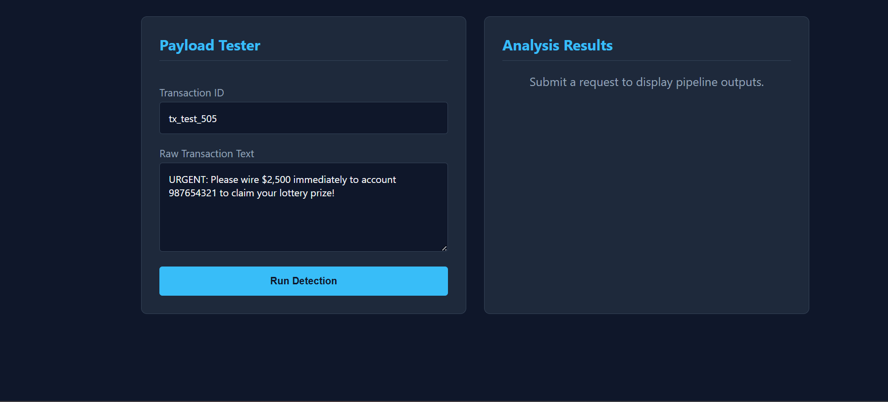
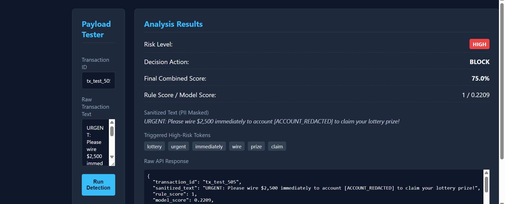
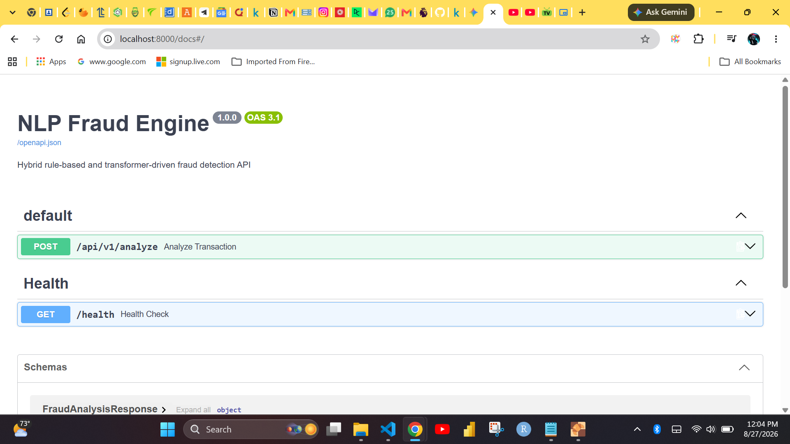
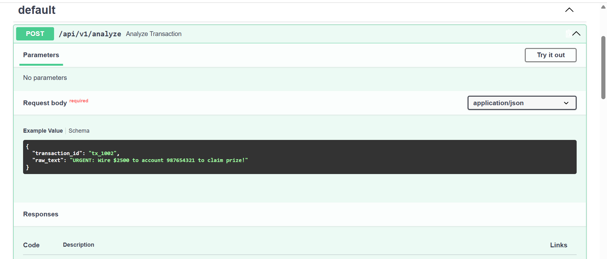

# NLP Fraud Detection Engine — User Guide & Manual

This guide provides detailed instructions on how to set up, configure, run, and integrate the **NLP Fraud Detection Engine**.

---

## Overview

The **NLP Fraud Detection Engine** is a hybrid security pipeline designed to analyze text payloads (e.g., transactional memos, payment notes, emails, SMS) for financial scam patterns, phishing, and advance-fee fraud. 

It combines three core architectural layers:
1. **PII Masking Preprocessor**: Automatic scrubbing of bank accounts, phone numbers, and emails before downstream processing.
2. **Deterministic Rule Engine**: High-precision regex pattern matching for urgency tokens, payment methods, and scam structures.
3. **Deep Learning Transformer**: Contextual NLP sequence classification using BERT-based models.

---

Quick Start

### 1. Prerequisites
- Python 3.10+
- Git

### 2. Environment Setup

Clone the repository and set up a virtual environment:

```bash
# Clone the repository
git clone https://github.com/BenYahMin/nlp-fraud-engine.git
# Cd into your folder
cd nlp-fraud-engine 

# Create and activate a virtual environment
python -m venv venv

# On Linux/macOS:
source venv/bin/activate
# On Windows (PowerShell):
.\venv\Scripts\Activate.ps1

# Install dependencies
pip install -r requirements.txt
```

3. Environment Variables Configuration
Create or update your .env file in the project root to optimize for High Recall (minimizing false negatives on scam attempts):
```
APP_NAME="NLP Fraud Engine"
ENVIRONMENT="development"
MODEL_PATH="mrm8488/bert-tiny-finetuned-sms-spam-detection"

# Score Fusion Weights (Must sum to 1.0)
RULE_WEIGHT=0.60
MODEL_WEIGHT=0.40

# Risk Thresholds
HIGH_RISK_THRESHOLD=0.75
MEDIUM_RISK_THRESHOLD=0.40
```
4. Running the Application
Start the FastAPI application with Uvicorn:

```bash
uvicorn app.main:app --reload --port 8000
```

Once running:

Web Dashboard: Open http://localhost:8000

Interactive OpenAPI/Swagger Docs: Open http://localhost:8000/docs

ReDoc Technical Specs: Open http://localhost:8000/redoc

Health Check: Open http://localhost:8000/health

Interface & Usage Methods
Method 1: Visual Web Dashboard (Browser)
Navigate to http://localhost:8000 in your browser to access the built-in test console.

Enter a Transaction ID (e.g., tx_1001).

Type or paste the payload into the Raw Transaction Text area.

Click Run Detection.

View real-time risk scores, PII redaction outputs, triggered rules, and decision labels.

Method 2: PowerShell API Request
Run the following command in PowerShell:
```
$headers = @{ "Content-Type" = "application/json" }
$body = @{
    transaction_id = "tx_9901"
    raw_text = "URGENT: Please wire $2,500 immediately to account 987654321 to claim your lottery prize!"
} | ConvertTo-Json

Invoke-RestMethod -Uri "http://localhost:8000/api/v1/analyze" -Method Post -Headers $headers -Body $body
```

Method 3: Python Integration Example
You can integrate this API into downstream microservices using standard HTTP requests:

import requests
```
API_URL = "http://localhost:8000/api/v1/analyze"

payload = {
    "transaction_id": "tx_4002",
    "raw_text": "Action required: Wire funds to crypto wallet to release inheritance."
}

response = requests.post(API_URL, json=payload)
data = response.json()

print(f"Risk Level: {data['risk_level']}")
print(f"Action: {data['action']}")
print(f"Sanitized Text: {data['sanitized_text']}")
print(f"Final Score: {data['final_score']}")
```
Method 4: cURL Request

```bash
curl -X POST "http://localhost:8000/api/v1/analyze" \
     -H "Content-Type: application/json" \
     -d '{
           "transaction_id": "tx_2001",
           "raw_text": "URGENT: Suspended account. Verify details immediately at user@example.com"
         }'
```

Automated Testing
Run the pytest suite to verify pattern matching, PII redaction integrity, and API endpoint routing:

```bash
pytest -v
```

---
## 1. Web Application User Interface

### Payload Tester (Initial View)
This primary Web UI allows users and security analysts to test transaction texts against the detection pipeline manually.



* **Inputs**: Accepts a unique `Transaction ID` (e.g., `tx_test_505`) and the raw transaction message payload.

* **Action**: Clicking **Run Detection** passes the message through sanitization (PII masking), rule-based keyword matching, and transformer model scoring.

---

### Analysis & Detection Output
Once the pipeline processes the transaction, detailed risk scoring and decision actions are displayed dynamically on the dashboard.



* **Risk Level & Decision**: Displays real-time risk classification (`HIGH`, `MEDIUM`, `LOW`) and automated actions such as `BLOCK` or `ALLOW`.
* **Combined Scoring**: Breaks down the aggregate risk score alongside individual metrics:
  * **Rule Score**: Evaluates rule-based triggers and high-risk token matches.
  * **Model Score**: Outputs the probability score generated by the NLP transformer model.
* **PII Redaction**: Automatically masks sensitive data (e.g., replacing bank account numbers with `[ACCOUNT_REDACTED]`).
* **High-Risk Tokens**: Highlights extracted trigger words (e.g., `lottery`, `urgent`, `immediately`, `wire`, `prize`, `claim`).
* **Raw JSON Response**: Provides the exact payload returned by the underlying REST API endpoint.

---

## 2. API Documentation (Swagger / OpenAPI UI)

### OpenAPI Overview & Interactive Endpoints
FastAPI automatically generates interactive Swagger UI documentation at `/docs` you can check there for details.



* **Endpoints**:
  * `POST /api/v1/analyze`: Core transaction evaluation route.
  * `GET /health`: Operational health check endpoint for monitoring uptime and status.

---

### Interactive Payload Testing (`POST /api/v1/analyze`)
Developers can test endpoints directly within the OpenAPI interface.



* **Sample Request Payload**:
```json
{
  "transaction_id": "tx_1002",
  "raw_text": "URGENT: Wire $2500 to account 987654321 to claim prize!"
}
Use the above sample request payload to navigate the listed options.
